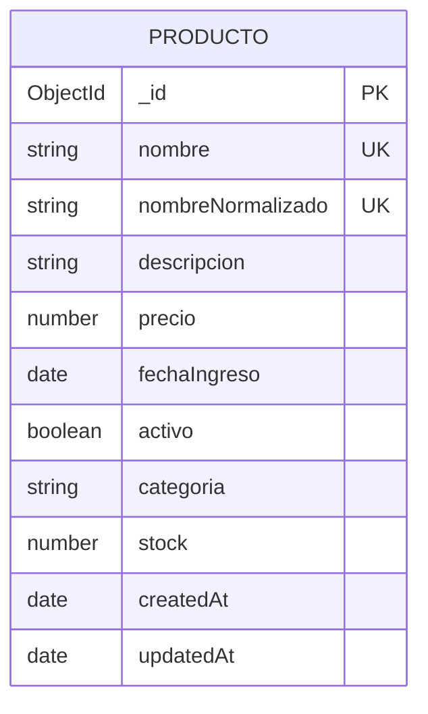

# Proyecto Final Integrador — SportStock (Productos Deportivos)

## 1) Nombre del proyecto
**SportStock**

## 2) Problema que resuelve
Muchos pequeños negocios de productos deportivos (tiendas físicas o en línea) gestionan su inventario de forma manual o en hojas de cálculo, lo que provoca errores de stock, precios desactualizados y dificultad para consultar productos activos/inactivos.

SportStock centraliza la gestión del catálogo para realizar operaciones CRUD de manera consistente desde diferentes clientes frontend (Angular y React) contra una misma API.

## 3) Descripción funcional
El sistema permite:
- Registrar productos deportivos.
- Listar productos con paginación.
- Buscar y filtrar por categoría y estado activo.
- Consultar detalle de un producto por ID.
- Editar información de productos.
- Eliminar productos.

## 4) Entidades

### 4.1 Producto (colección principal)
Campos:
- `_id`: ObjectId (autogenerado por MongoDB)
- `nombre`: String (requerido, único, min 3, max 120)
- `descripcion`: String (requerido, min 10, max 500)
- `precio`: Number (requerido, rango 1 a 10000)
- `fechaIngreso`: Date (requerido)
- `activo`: Boolean (requerido, por defecto `true`)
- `categoria`: String (requerido; valores permitidos: `calzado`, `ropa`, `accesorios`, `equipamiento`)
- `stock`: Number (requerido, entero, mínimo 0)
- `createdAt`: Date (autogenerado)
- `updatedAt`: Date (autogenerado)

## 5) Reglas de negocio
1. **No duplicados por nombre** (ignorando mayúsculas/minúsculas).
2. **Rangos válidos**:
   - `precio` entre 1 y 10000.
   - `stock` entero y >= 0.
3. **Restricción de estado**:
   - Si `activo=false`, entonces `stock` debe ser 0.
4. **Filtro por categoría**:
   - Solo se permite consultar/registrar categorías válidas.

## 6) Arquitectura del proyecto
```
/project-root
  /backend
    /src
      /config
      /models
      /controllers
      /routes
      /middlewares
      /utils
    app.js
    server.js
  /frontend-angular
  /frontend-react
```

## 7) Endpoints API (v1)
Base URL local: `http://localhost:4000`

### Documentación
- `GET /api/v1/documentacion`

### Productos
- `GET /api/v1/productos/get/all`
  - Query params opcionales:
    - `page` (default 1)
    - `limit` (default 10)
    - `categoria` (`calzado|ropa|accesorios|equipamiento`)
    - `activo` (`true|false`)
    - `search` (texto en nombre)
- `GET /api/v1/productos/get/:id`
- `POST /api/v1/productos/post`
- `PUT /api/v1/productos/update/:id`
- `PATCH /api/v1/productos/update/:id`
- `DELETE /api/v1/productos/delete/:id`

## 8) Formato general de respuesta
Ejemplo éxito:
```json
{
  "success": true,
  "message": "Productos obtenidos correctamente",
  "data": [],
  "meta": {
    "total": 20,
    "page": 1,
    "limit": 10,
    "totalPages": 2
  }
}
```

Ejemplo error:
```json
{
  "success": false,
  "message": "No se encontró el producto"
}
```

## 9) Instalación y ejecución (Backend)
Desde `backend/`:

1. Instalar dependencias:
   ```bash
   npm install
   ```
2. Configurar variables:
   - Copiar `.env.example` a `.env`
3. Ejecutar seed (20+ registros):
   ```bash
   npm run seed
   ```
4. Ejecutar servidor:
   ```bash
   npm run dev
   ```

## 10) Evidencia de pruebas
- Probar endpoints con Postman usando los métodos GET/POST/PUT/PATCH/DELETE.
- Verificar paginación (`page`, `limit`) y filtros (`categoria`, `activo`, `search`).

## 11) Estado por fases
- ✅ Fase 1: Diseño + Backend (base implementada)
- ✅ Fase 2: Frontend Angular (implementada localmente)
- ✅ Fase 3: Frontend React (implementada localmente)

## 12) Fase 2 — Frontend Angular

Se implementó un cliente Angular en `frontend-angular/` que consume la API del backend sin modificar endpoints.

### Funcionalidades implementadas
- Listado de productos en tarjetas (Bootstrap), 6 por página.
- Filtros por `search`, `categoria` y `activo`.
- Paginación (`page`, `limit`) desde frontend.
- Vista detalle por ID.
- Formulario reactivo para crear/editar.
- Eliminación con confirmación.
- Validaciones visuales y funcionales.
- Loader de carga y mensajes de éxito/error.
- Imagen clicable para previsualización ampliada (modal/lightbox).

### Ejecución local (Backend + Angular)
1. Iniciar backend en una terminal (carpeta `backend/`):
  ```bash
  npm run dev
  ```
2. Iniciar Angular en otra terminal (carpeta `frontend-angular/`):
  ```bash
  npm start
  ```
3. Abrir en navegador:
  - `http://localhost:4300`

### Verificación rápida (rúbrica Angular)
- Crear un producto nuevo desde `/productos/nuevo`.
- Editar un producto desde el botón **Editar**.
- Eliminar un producto desde el botón **Eliminar**.
- Ver detalle desde el botón **Ver**.
- Probar filtros (`search`, `categoria`, `activo`).
- Probar paginación (Anterior/Siguiente).

## 13) Fase 3 — Frontend React

Se implementó un cliente React en `frontend-react/` que consume la misma API del backend sin modificar endpoints.

### Funcionalidades implementadas
- Componentes funcionales con Hooks (`useState`, `useEffect`, `useMemo`).
- Navegación con React Router.
- CRUD completo (listar, ver detalle por id, crear, editar, eliminar).
- Formularios controlados con validaciones.
- Filtros por `search`, `categoria`, `activo`.
- Paginación (`page`, `limit`) con 6 productos por página.
- Bootstrap aplicado para layout, formularios, tarjetas y botones.
- Loader de carga y mensajes de éxito/error.
- Imagen clicable para previsualización ampliada (modal/lightbox).

### Ejecución local (Backend + React)
1. Iniciar backend en una terminal (carpeta `backend/`):
  ```bash
  npm run dev
  ```
2. Iniciar React en otra terminal (carpeta `frontend-react/`):
  ```bash
  npm run dev
  ```
3. Abrir en navegador:
  - `http://localhost:5173`

### Verificación rápida (rúbrica React)
- Crear un producto desde `/productos/nuevo`.
- Editar un producto desde el botón **Editar**.
- Eliminar un producto desde el botón **Eliminar**.
- Ver detalle desde el botón **Ver**.
- Probar filtros y paginación.

## 14) Entrega final (checklist)

- ✅ Backend completo (arquitectura, CRUD, validaciones, reglas de negocio, seed).
- ✅ Frontend Angular completo (consumo API + CRUD + formularios reactivos + Bootstrap).
- ✅ Frontend React completo (consumo API + CRUD + hooks + React Router + Bootstrap).
- ✅ Documentación base de proyecto y endpoints.
- ⏳ URL backend desplegado: pendiente de publicar.
- ⏳ URL frontend Angular desplegado: pendiente de publicar.
- ⏳ URL frontend React desplegado: pendiente de publicar.

> Nota: el código queda finalizado en entorno local; para cerrar al 100% la entrega académica solo falta publicar las tres URLs de despliegue.

## 15) URLs de despliegue

- Backend desplegado: pendiente
- Frontend Angular desplegado: pendiente
- Frontend React desplegado: pendiente

## 16) Pasos de despliegue (rápido)

### 16.1 Backend en Render
1. Subir repo a GitHub.
2. Crear Web Service en Render apuntando a `backend/`.
3. Configurar:
  - Build Command: `npm install`
  - Start Command: `npm start`
4. Variables de entorno en Render:
  - `PORT=4000`
  - `MONGODB_URI=...`
  - `NODE_ENV=production`
5. Guardar URL pública del backend (`https://...render.com`).

### 16.2 Frontend React en Vercel
1. Importar proyecto en Vercel desde GitHub.
2. Root Directory: `frontend-react`.
3. Variable de entorno:
  - `VITE_API_BASE_URL=https://TU_BACKEND_RENDER/api/v1`
4. Deploy y guardar URL pública.

### 16.3 Frontend Angular en Vercel
1. Importar proyecto en Vercel desde GitHub.
2. Root Directory: `frontend-angular`.
3. Antes de deploy, editar `frontend-angular/src/environments/environment.ts` y poner:
  - `apiBaseUrl: 'https://TU_BACKEND_RENDER/api/v1'`
4. Deploy y guardar URL pública.

## 17) Capturas de pantalla

- Captura 1 — Listado de productos (Angular): pendiente
- Captura 2 — Formulario crear/editar (Angular): pendiente
- Captura 3 — Detalle de producto (Angular): pendiente
- Captura 4 — Listado de productos (React): pendiente
- Captura 5 — Formulario crear/editar (React): pendiente
- Captura 6 — Detalle de producto (React): pendiente

## 18) Evidencia Postman (para anexar en la entrega)

Exportar en Postman:
- Collection: `SportStock API v1.postman_collection.json`
- Environment (opcional): `SportStock Local.postman_environment.json`

Solicitudes mínimas a evidenciar (captura + respuesta):
- `GET /api/v1/productos/get/all?page=1&limit=6`
- `GET /api/v1/productos/get/all?categoria=calzado&activo=true`
- `GET /api/v1/productos/get/all?search=balon`
- `GET /api/v1/productos/get/:id`
- `POST /api/v1/productos/post`
- `PUT /api/v1/productos/update/:id`
- `PATCH /api/v1/productos/update/:id`
- `DELETE /api/v1/productos/delete/:id`

Evidencias recomendadas:
- Caso exitoso por cada endpoint.
- Caso de error de validación (por ejemplo, `activo=false` con `stock>0`).
- Caso de error por ID inválido/no existente.

## 19) Diagrama de colección (MongoDB)



## 20) Cierre de entrega (último paso)

Checklist final antes de enviar:
- [ ] Backend desplegado (Render) y URL pública agregada en este README.
- [ ] Frontend Angular desplegado y URL pública agregada en este README.
- [ ] Frontend React desplegado y URL pública agregada en este README.
- [ ] Capturas (Angular + React) anexadas.
- [ ] Colección Postman exportada y anexada.
- [ ] Evidencias de pruebas (éxito + error) anexadas.

Estado técnico del código:
- Backend: OK (arranca y responde).
- Angular: OK (build exitoso).
- React: OK (build exitoso).
